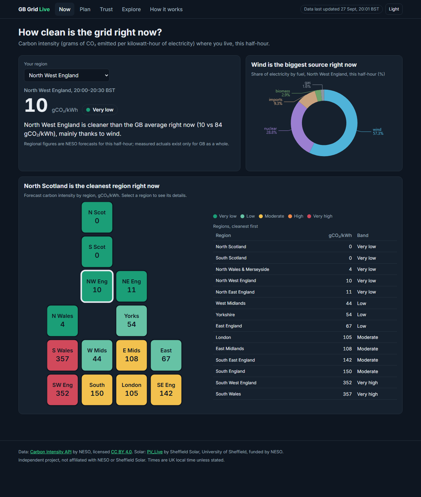
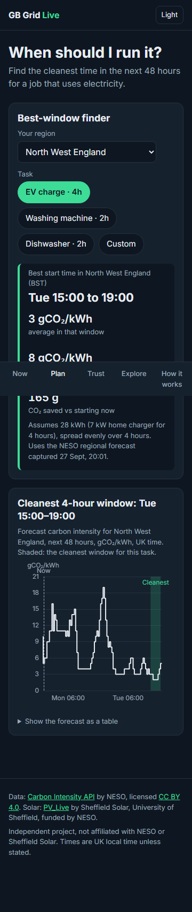
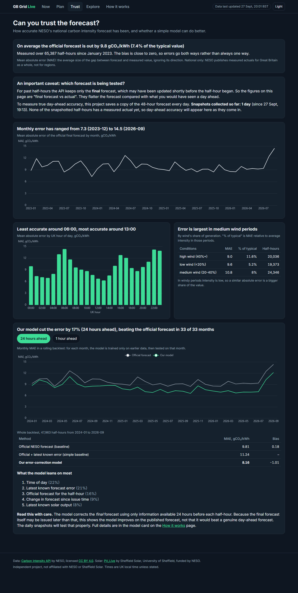
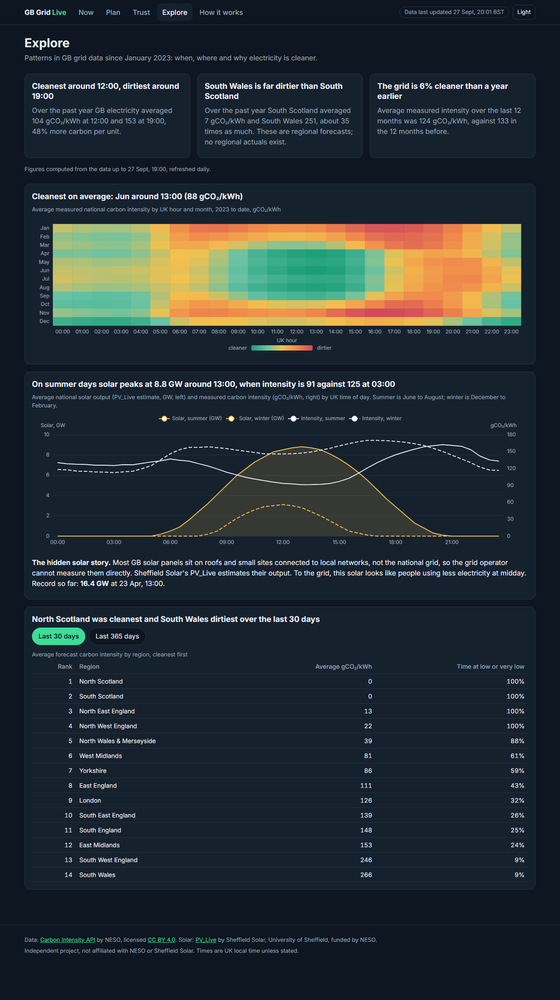

# GB Grid Live

*Use power when the grid is cleanest.*

**Live site: https://hutchybakes-glitch.github.io/gb-grid-live/**

GB Grid Live shows how clean electricity is in each region of Great Britain right now, and finds the cleanest time in the next 48 hours to charge a car or run the washing machine. Behind it is a daily data pipeline (Python, DuckDB, dbt) that ingests open data from NESO and Sheffield Solar, tests the data, and publishes a static site through GitHub Actions. It also checks how accurate the official NESO carbon forecast is, and backtests an error-correction model against it honestly.

| Now | Plan (mobile) |
| --- | --- |
|  |  |
| **Trust** | **Explore** |
|  |  |

## How it works

```
Carbon Intensity API ─┐                    dbt (DuckDB)                      LightGBM
PV_Live (solar) ──────┴─> raw JSON ─> bronze ─> silver ─> gold ──> model backtest ─> JSON ─> React site
                         (≤14-day chunks,     (typed)  (deduped,  (one table                  (GitHub Pages)
                          1 request/s)                  UTC)       per chart)
```

- **Runs daily** at 05:30 UTC on GitHub Actions (`.github/workflows/daily.yml`): ingest, snapshot the 48h forecast, `dbt build` with about 80 data tests, model backtest, export, site tests, then deploy.
- **Data quality** is published on the site: gaps in the source data are counted and listed, never filled in.
- **Every non-obvious choice** is in [`docs/DECISIONS.md`](docs/DECISIONS.md); what was built, what broke and how it was fixed is in [`docs/BUILD_LOG.md`](docs/BUILD_LOG.md).
- **`learning/`** has line-by-line commented copies of the key modules.

## Setup (Windows, PowerShell)

```powershell
git clone https://github.com/hutchybakes-glitch/gb-grid-live.git
cd gb-grid-live
python -m venv .venv
.\.venv\Scripts\Activate.ps1
python -m pip install -r requirements.txt
python -m pipeline.run        # first run backfills from 2023 (~40 minutes, politely rate-limited)
```

Requires Python 3.11+ and Node.js 24 LTS. No API keys or secrets are needed.

## Commands

| Command | What it does |
| --- | --- |
| `python -m pipeline.run` | **The whole pipeline:** backfill (only new or recent chunks), forecast snapshot, `dbt build` (all models and tests) into `data/warehouse.duckdb`, model backtest, then export JSON for the site. Add `--skip-ingest` to rebuild from raw files without calling the APIs. |
| `python -m pipeline.backfill` | Downloads raw data for both sources from 2023-01-01 to the current half-hour, in ≤14-day chunks at no more than one request per second. Safe to stop and rerun: completed chunks are skipped. Options: `--start`, `--end`, `--sources`. |
| `python -m pipeline.snapshot` | Saves the current 48-hour national and regional forecasts with a `captured_at` time (gzipped). |
| `python -m pipeline.model.backtest` | Rolling-origin backtest of the error-correction model. |
| `python -m pipeline.export` | Writes the site's JSON files from the gold tables to `web/public/data/`. |
| `python -m pipeline.summary` | Prints files, rows and date coverage per raw source. |
| `python -m pytest` | Python unit tests (offline; network access is blocked). |

### Website (in `web/`)
```powershell
cd web
npm install
npm run dev          # local development server
npm run build        # production build into web/dist
npm test             # unit tests (best-window finder)
npx playwright install chromium
npm run e2e          # smoke tests against the production build (desktop and 360px)
```

## Data sources and credits
- **Carbon Intensity API**, NESO, CC BY 4.0: https://carbonintensity.org.uk
- **PV_Live**, Sheffield Solar (University of Sheffield), funded by NESO: https://www.solar.sheffield.ac.uk/pvlive/
- **Historic Demand Data**, NESO, NESO Open Data Licence: https://www.neso.energy/data-portal/historic-demand-data

Independent project, not affiliated with NESO or Sheffield Solar.

## Built with Claude Code
The code was written by Claude Code working from a written spec (`SPEC.md`, `DATA.md`, `DESIGN.md`, `PHASES.md`, `ACCEPTANCE.md`) in five phases, each ending with acceptance checks whose evidence is recorded in the build log. Samuel wrote the spec, made the product decisions and reviewed each phase.
